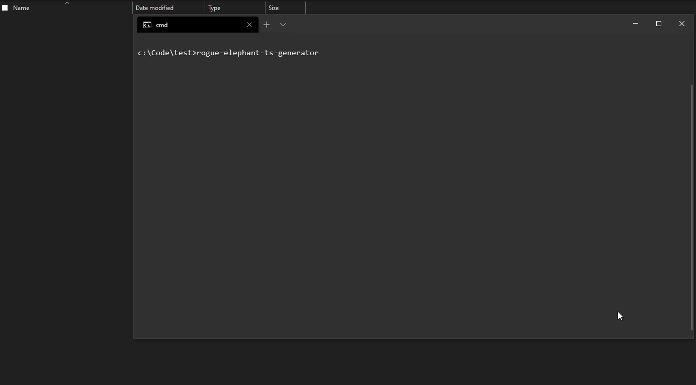

# Typescript Starter Project
This project is meant as a skeleton for creating new node libraries that can be deployed to npm etc.

## How to use
Once installed simply run:

```rogue-elephant-ts-generator```

in your terminal and answer the prompts.



## References
I used the amazing article here - https://medium.com/@pongsatt/how-to-build-your-own-project-templates-using-node-cli-c976d3109129 to help me setup the template generation.